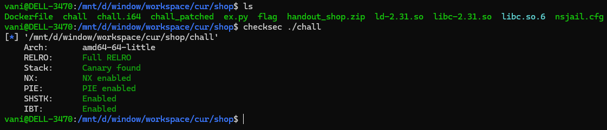
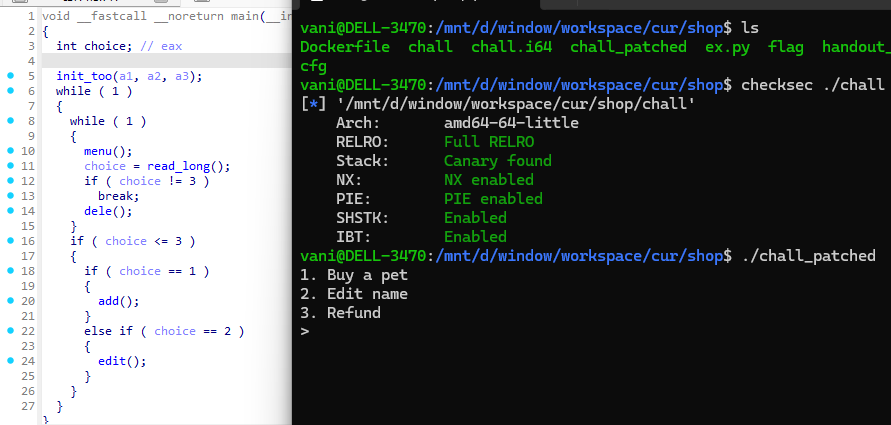
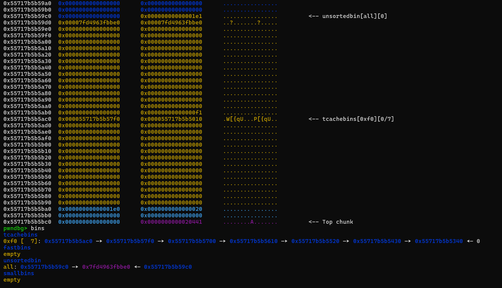
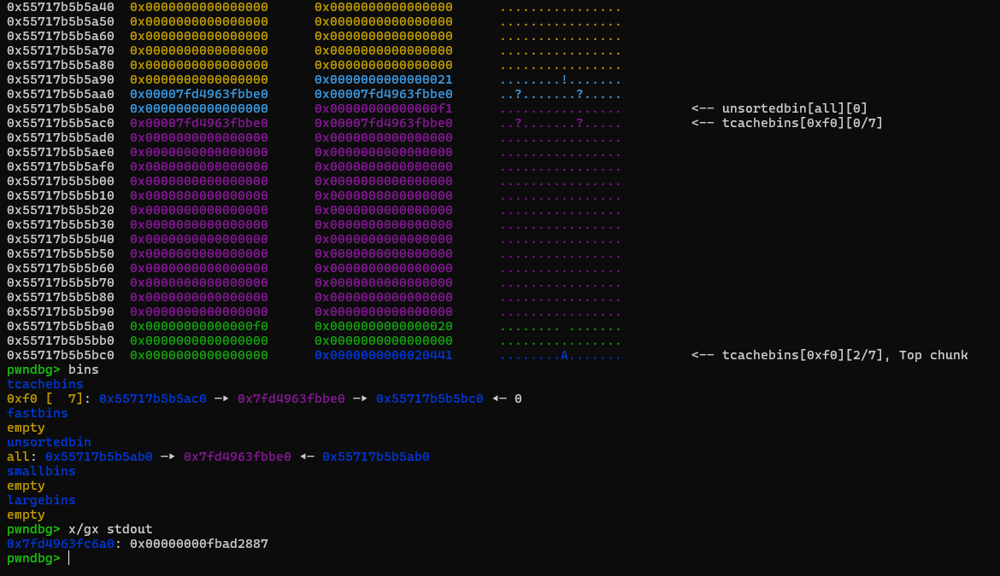

### shop

was a heap-pwn challenge from cyberspace ctf 2024.

the binary checksec:

pretty standard heap note-style chall:

use decompiler, you can see that there is a obiviously double free bug (in `dele` func (`refund`))...

but there is no "view" function, we can not leak anything useful... the technique using here is `stdout 0.5`!

since i have dbf bug, i modify `house a botcake` a little, to have promised heap layout

we can see that unsortedbin chunk are overlapping with tcache chunk. Then i fengshui a little to make unsortedbin `fd ptr` drop to tcache `fd ptr`

so there is a libc value exist in tcache bins. Also after modified, i also have somekind of UAF (because of overlapping chunks), we now modified last 2 byte of tcache head bins, to make it point to `stdout` (required bruteforce here!)

all we have to do next is applied `stdout 0.5` tricks to have libc leak -> then perform fsop to get shell.

i suggest you should read `stdout 0.5` docs in `fsop` folder...

the full exploit can be found in `ex.py` in the same folder...