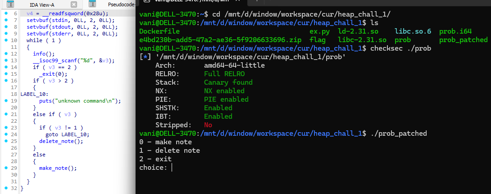
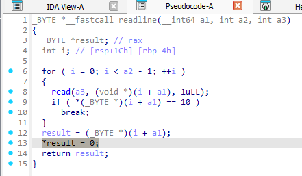
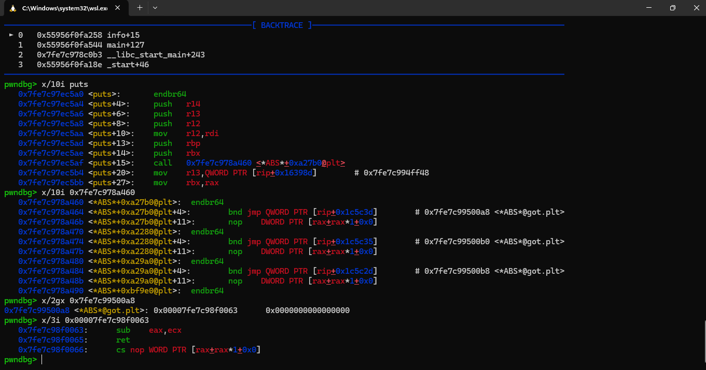
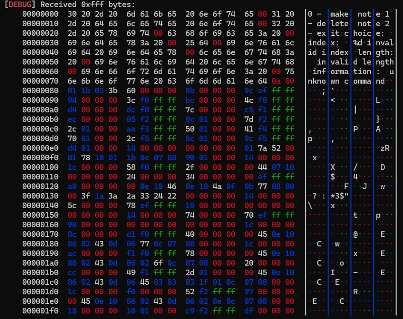

heap chall 1 is a level 8 dreamhack challenges, it quiet annoying imo. I didnt solved the challenge on my own, i asked my friend for ideas then follow that, but somehow its still hard and yes i learned something...

the challenge is heap style-note chall with full mitigations...



using decompiler you can find a obiviously double free bug in `delete_note` function (navigate it by yourself)

the program has no "view" function, means we can not leak anything useful...

first i come up with idea using `stdout 0.5` tricks to have a leak, but...

when we input data for a heap chunk, program auto add a null byte after



> suppose that you are familiar with `stdout 0.5` 
 
imagine that if we using `stdout 0.5`, means modify last `2 bytes` of `main_arena` libc address leaved on heap -> the address will be something like this `0x7f????00abcd` with `0xbcd` is the last 12 bits of `stdout` always stays the same, `a` is random number we have to guess and auto `00` byte added by program...

we can only hope that we successfully allocate on stdout structure with the success rate `1/4096`  (`0x...00a...`)  its terrible...

there is a clever way to bypass this!

among the writeable libc areas (**with given libc**), there is a `0x?????????0??` addresses of the form can be covered with 1/16 brute force even if there is a null byte after them

that area is libc got area, more clearly, in this challenge, we will aim for `strlen` got entry which is at `0x?????????0a8`

then we will try to modify instruction address there to some where more helpful for us, the gadget

> this can not find by ROPgadget but rp++, **so use rp++ from now!!!**

```
0x18b063: sub eax, ecx ; ret ;
```

the overwrite strlen to gadget part can satisfy with another 1/16 bruteforces...

if you success, it shoule be like this:



`strlen` now has been modified to our desired gadget, everytime program call `puts`, it will miscalculated string length and print out many thing interesting, include libc address somewhere...



> this is where i fall down to rabbit hole, somehow, the local leak and remote leak is different, with local its behaviour as expected but the remote wont print out the menu when first time attemp after overwrite `strlen`, as debug i see that there are some syscall `write(1, buf, n)` with **n is negative number**, i dont know if it makes different, remote environment is `20.04` and mine is `22.04`...
> or there is something wrong with pwntools `p.recv()`, as i search it only receive maximum 4096 bytes...
> many question here, but after all, i finish the script stable in both local and remote.

after we have a leak, everything is easy, abusing the double free bug again, perform fastbin dup, attack the `__free_hook` then get shell, it is basic...

the full exploit can be found in the ex.py in same folder...