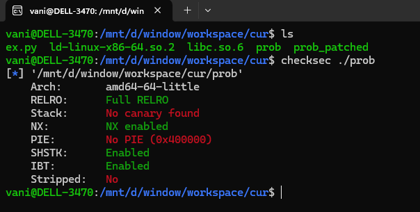
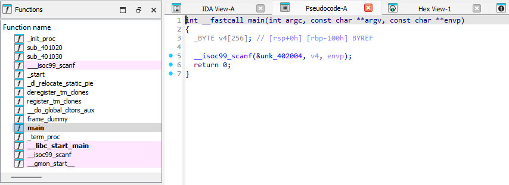
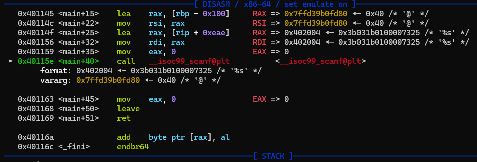
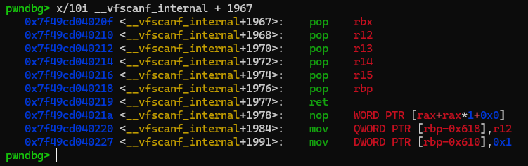
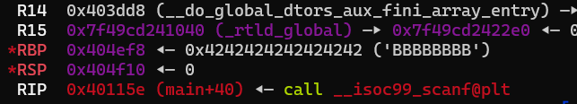
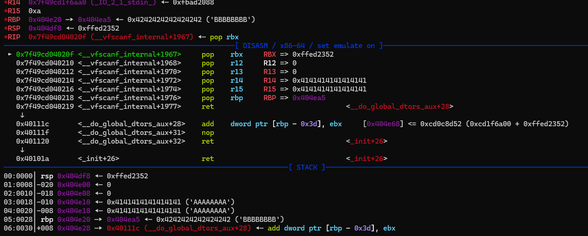
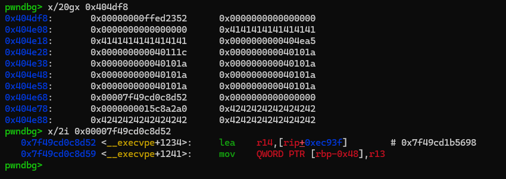

### pop rdi

is a level 8 pwn challenges from Dreamhack.io wargame, i learned some tricks from solving this chall...

the binary checksec:



the chall has no print function, only scanf:



using gdb, we can see that it has obviously bof:



as challenge's description, there is no `pop rdi` gadget from this binary

full RELRO --> means no GOT attack, we need to somehow perform a `ret2libc` or similar..

for this kind of challenges (no leak, no PIE), (i learned that) we should first, stack pivot (to the `.bss` section) then call some libc function so there will be **libc address values leave in our (fake) stack**...

using those left values and this `add_gadget`:

```
0x000000000040111c : add dword ptr [rbp - 0x3d], ebx ; nop ; ret
```

since we can control the `rbp` (usually `rbx` too), fengshui (addition/subtraction) the offset, so we will have a address point to system or `one_gadget` (simply the win function)...

sadly we don't have the `pop rbx` in this challenge, so i will use **this stack pivot trick**:

`scanf` function will call `__vfscanf_internal` (inside libc implement) when calling it, program need to stored registers's values on stack to restore it later...



imagine program flow like this: 

program call `scanf` -> `scanf` call `__vfscanf_internal` + stored resgister' values on (fake) stack -> ... -> `syscall read` -> ... -> restore register's values (pop values on stack) and return -> ... -> continue the program...

since we control the stack (pivoting), we set up `rbp` and `rsp` so that when `syscall_read` occurs, we modify those register's values on stack...

(like this (in this challenge)):


> becareful when `rbp < rsp`, it usually occur some errors...

let see when the program restore the values:

```
pwndbg> b *__vfscanf_internal + 1967
```



i even put a ROP there, so after execute, we will have a win function value (in `0x404e68`):



then just padding to ret2win...

the full exploit can be found in the `ex.py` in same folder...