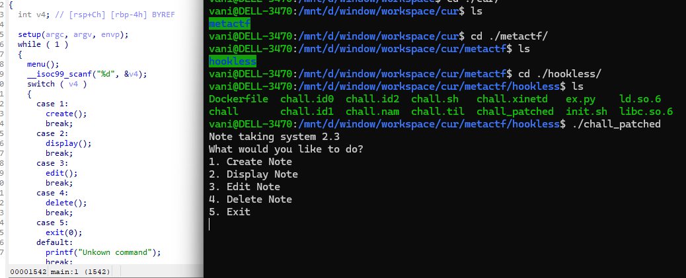
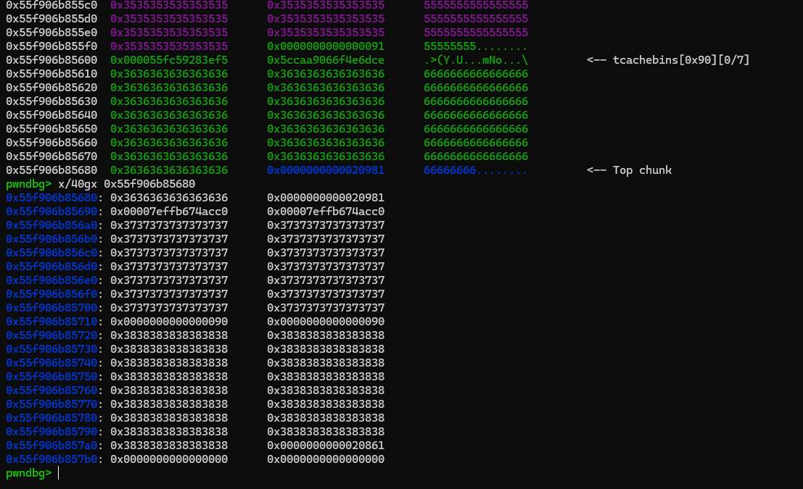

### hookless

is a pretty standard heap menu type challenge...

using decompiler, you can see that there are obiviously bugs:
- DBF in `delete` function, as the allocation pointers are not nulled after a free.
- UAF in `display` function -> useful to leak addresses, both heap and libc...
- UAF in `edit` function, but **only can use one time** (but I dont even use it, dark....)

the program limits us to 15 allocation, so `house_of_botcake` is a wise choice, i even modify it a little bit to fit with max 15 (but it's not necessary)...

basically, first allocate 9 chunk size `0x90`, `malloc(0x88)` (**there is no** padding chunk to prevent consolidation)

then free all 9 of them, so first 7 chunk will go to tcache bin, and last 2 will go to unsortedbin then consolidate with top chunk

when they consolidate with top chunk, program doesnt "memset" the data

we take 1 chunk from tcache, make available space and free the victim chunk again (doube free primitive), now victim chunk is in `0x90` tcache head, but it's above the top chunk!

allocate a big size chunk (i used `0x128`) will create a chunk overlapping with victim chunk (since there is no fit bin so it will be allocated from top chunk)...

use this primitive to tcache poisoning, target the `strlen` got entry, overwrite it with `one_gadget`.The whole process need 13 allocations, voila!

the full exploit can be found in `ex.py` in the same folder...