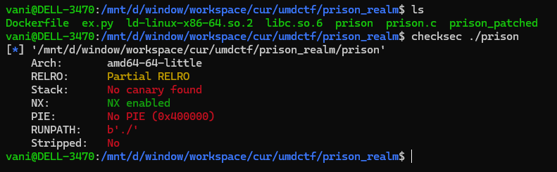
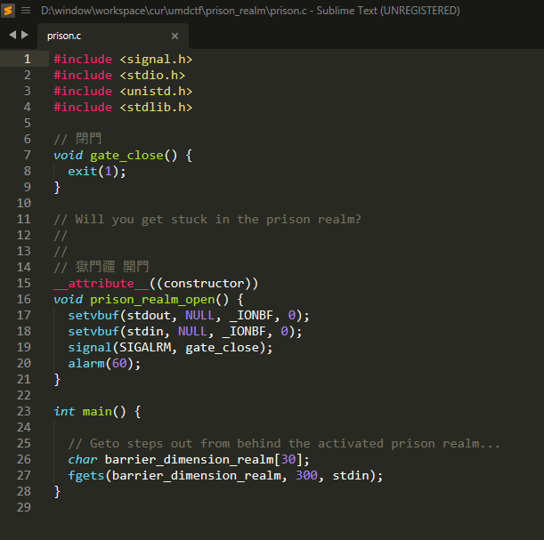
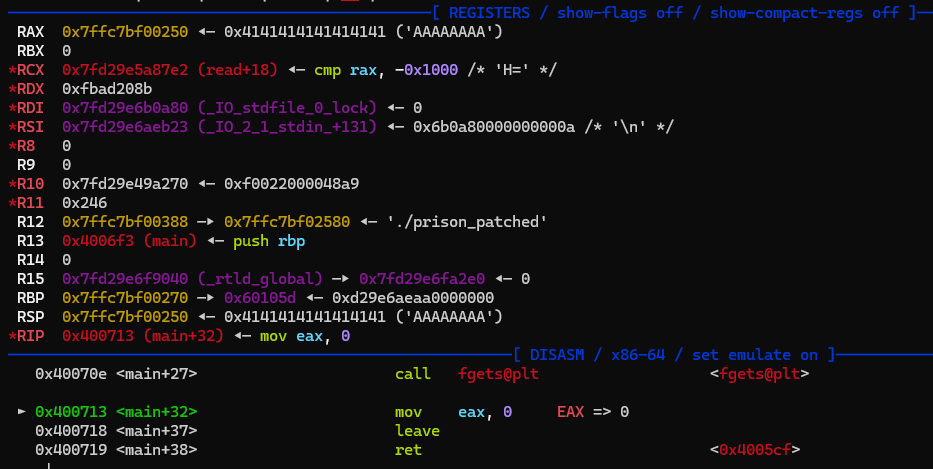
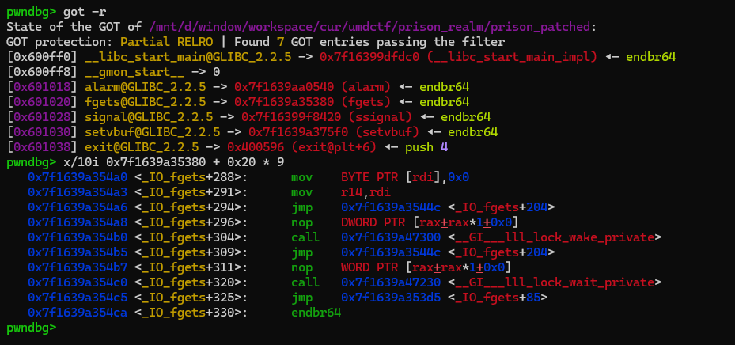
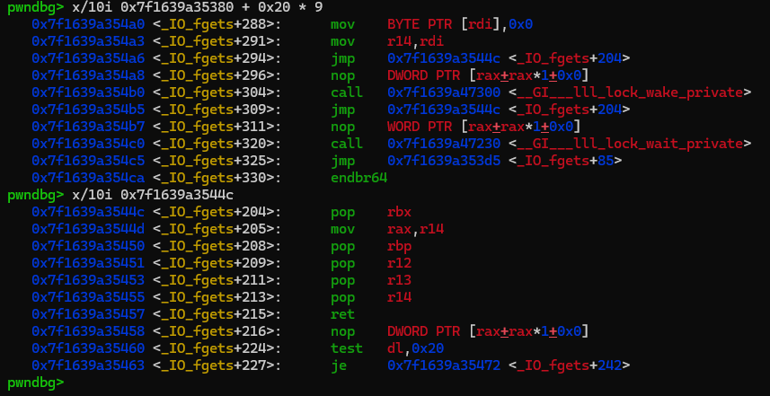
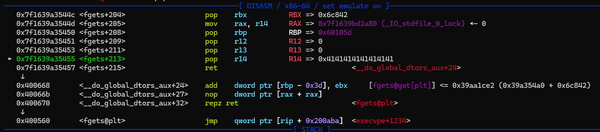
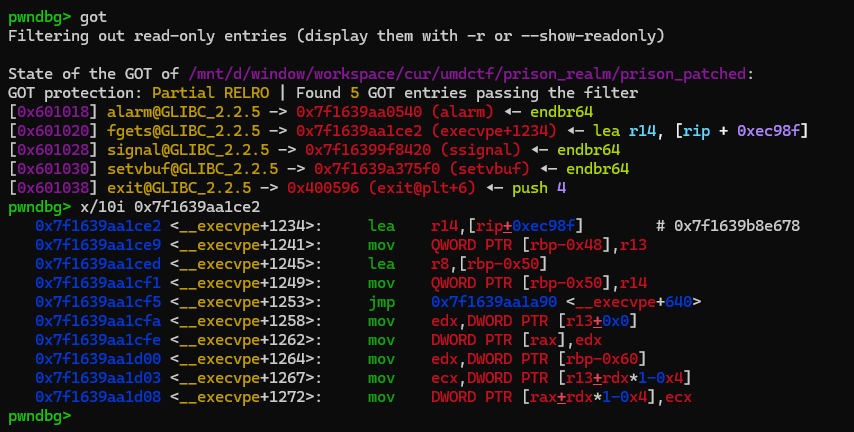

### prison realm

was a challenge from UMD CTF 2025.

i couldn't solve it during the contest, but there are something worth to discuss...

the binary has very few mitigations, checksec:



we even provided source code, look through it, there is a obivious bof:



since the program use `fgets` (include `0xa` byte + auto add a terminate null byte at the end), the trick partial overwrite got + bruteforces won't work here...

using `ROPgadget` (i prefer `rp++`) we can find 2 this useful gadget (i'll describe later):

```
0x00000000004005cf : add bl, dh ; ret
0x0000000000400668 : add dword ptr [rbp - 0x3d], ebx ; nop dword ptr [rax + rax] ; repz ret
```

we can control `rbp` (via pivoting) (as expected), if we control `rbx` also, we can somehow perform a write-what-where primitive...
> there is no `pop rbx` gadget, fck...

set a breakpoint right after program execute `fgets`, navigate the registers:



we can see that `rdx` always equal to `0xfbad208b` and `rbx` is null.

so using two those gadget, we can increase (or decrease) any value with multiple of `0x20`, here i'll target `fgets` GOT...

why? let's see something:



if we modify the `fgets` GOT to `_IO_fgets + 288`, everytime we call `fgets` we will have a custom `pop rbx` gadget:



now we can control `rbx` -> use those gadget again, perform a write-what-where primitive -> target the fgets got again, modify it to `one_gadget` (calculate the offset by yourself...)



after all, the fgets GOT now is `one_gadget`, just need to call `fgets` again to trigger shell:



the full exploit can be found in the `ex.py` in same folder...

