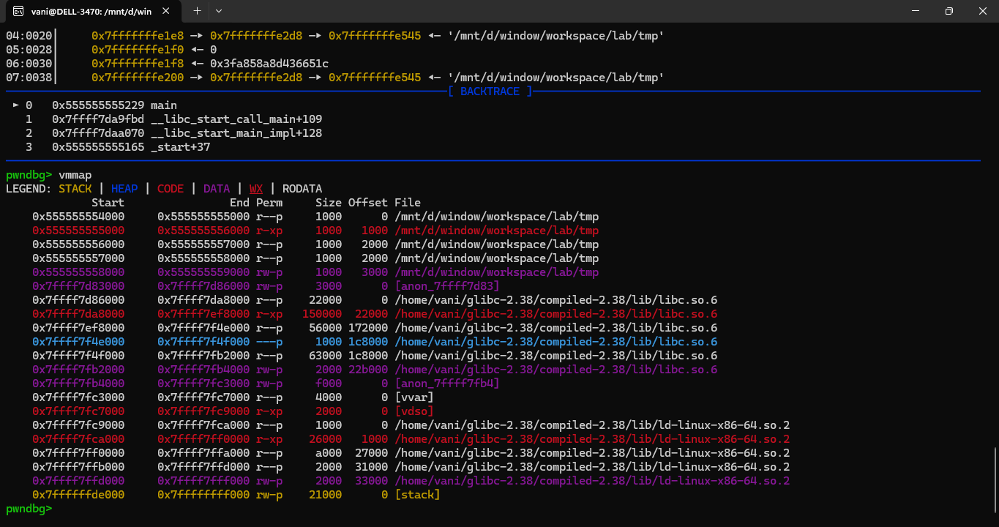
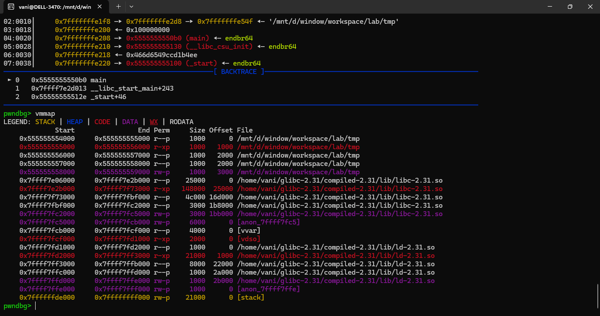

## Compiling

<details>
<summary><strong>Description</strong></summary>
<p>

The standard glibc version on your system might be different with me. If it is, there will be differences in how the heap works. This doc shows you how to compile libc from source, and compile binaries to link against that, for further use (compiling, debugging, testing...). I write this based on this [ref](https://github.com/guyinatuxedo/Shogun/blob/main/compiling/compiling.md).

The current versions we are working with is `2.3x` (mostly `2.31`, `2.35`, `2.38` and `2.39`). There are some big changes between those versions, which affect a lot on exploits. This ref only guides you set up version `2.38`, you can do the same way for the others (`2.35` and `2.39`). 

But for the `2.31` version, since my OS is `wsl2 ubuntu 22.04.5 LTS`, building a glibc from source code is harder, `chatgpt` helped me a lot. 
> I'm not a god btw :(

</p>
</details>

## For `2.35+` versions

<details>
<summary><strong>Compiling Libc</strong></summary>
<p>

So, first off we need to download the glibc source code. You can find the mirrors at `https://www.gnu.org/software/libc/`. I recommend you download from the `/home/usr` folder (like me):

```
vani@DELL-3470:~$ pwd
/home/vani
```

Extract the glibc code, and create the build directory:

```
$   cd ~
$   tar -xf glibc-2.38.tar.bz2
$   cd glibc-2.38/
$   mkdir compiled-2.38
$   mkdir build
$   cd build/
```

Also, these are some things we need installed to compile glibc:

```
$   sudo apt-get install gcc make gawk bison
```

Then, from the `build` directory, we will go ahead and configure glibc for compiling:

```
$   ../configure --prefix=$HOME/glibc-2.38/compiled-2.38/
 . . .
```

Then, we will go ahead and compile glibc, this will take like 10 minutes:

```
$   make -j
 . . .
```

```
$   make install
 . . .
```

</p>
</details>

<details>
<summary><strong>Compile binaries to linking against to new Libc</strong></summary>
<p>

To compile binaries to link against the newly compiled libc version:

> Assume that you want to compile a C file `tmp.c` (in anywhere, since the libc stays in fixed path, just copy this command).

```
$   gcc -Xlinker -rpath=$HOME/glibc-2.38/compiled-2.38/lib/ -Xlinker -I$HOME/glibc-2.38/compiled-2.38/lib/ld-linux-x86-64.so.2 tmp.c -o tmp
```

Let's confirm that we are actually using the libc we compiled:

> Im using pwndbg.

```
$   gdb ./tmp
```

```
pwndbg> b *main
pwndbg> r
pwndbg> vmmap
```

It should shows something like this:



</p>
</details>

## For `2.31` version

<details>
<summary><strong>Compiling Libc</strong></summary>
<p>

Download, extract the glibc code, and create the build directory:

```
$   cd ~
$   tar -xf glibc-2.31.tar.bz2
$   cd glibc-2.31/
$   mkdir compiled-2.31
$   mkdir build
$   cd build/
```

Also, we need to install and use `gcc 9`, it is compatible with glibc `2.31`:

> Yes, it's completely okay and safe to have multiple `gcc` versions installed side-by-side on WSL2 or any Ubuntu system.

```
sudo apt install gcc-9 g++-9
```

Then, from the `build` directory, we configure glibc for compiling:

```
CXX=true CC=gcc-9 ../configure --prefix=$HOME/glibc-2.31/compiled-2.31 --disable-werror --without-selinux
```

> Ah this is awful, this (`chatgpt`'s) command tells the build system:
> - Use `gcc-9` as the C compiler
> - Pretend the C++ compiler is `true` (disabled)
> - Disable SELinux support
> - Ignore warnings as errors
>
> That should help you avoid many linking errors you don't want to see.

Then, we will go ahead and compile glibc, this will take like 10 minutes:

```
$   make -j
$   make install
```

</p>
</details>

<details>
<summary><strong>Compile binaries to linking against to new Libc</strong></summary>
<p>

To compile binaries to link against the newly compiled libc version.

> Assume that you want to compile a C file `tmp.c` (in anywhere, since the libc stays in fixed path, just copy this command).

Magic command:

```
$   gcc-9 -nostartfiles tmp.c -o tmp \
  -I$HOME/glibc-2.31/compiled-2.31/include \
  $HOME/glibc-2.31/compiled-2.31/lib/crt1.o \
  $HOME/glibc-2.31/compiled-2.31/lib/crti.o \
  -L$HOME/glibc-2.31/compiled-2.31/lib -lc \
  $HOME/glibc-2.31/compiled-2.31/lib/crtn.o \
  -Wl,--rpath=$HOME/glibc-2.31/compiled-2.31/lib \
  -Wl,--dynamic-linker=$HOME/glibc-2.31/compiled-2.31/lib/ld-linux-x86-64.so.2
```

> This is even more awful, (`chatgpt`'s) explaination (for further handle errors):
> - `gcc-9`: use `gcc` version 9, which may be compatible with building older glibc versions.
> - `-nostartfiles`: prevents `gcc` from automatically adding startup files (`crt1.o`, `crti.o`, `crtn.o`). You’ll manually specify them instead (see below). This avoids conflicts with the system startup files.
> - `-I$HOME/glibc-2.31/compiled-2.31/include`: use headers from your custom glibc 2.31 build, not the system's.
> - `$HOME/glibc-2.31/compiled-2.31/lib/crt1.o`, `crti.o`, `crtn.o`: these are glibc startup object files, required for initialization and finalization of a program.
> 	- `crt1.o`: defines the `_start` symbol
> 	- `crti.o`: sets up `.init`/`.fini` sections
> 	- `crtn.o`: completes `.init`/`.fini`
> - `-L$HOME/glibc-2.31/compiled-2.31/lib`: adds your glibc build’s `lib/` directory to the library search path.
> - `-lc`: links against the C standard library (`libc.so.6`), from the custom glibc directory (due to `-L` above).
> - `-Wl,--rpath=...`: embed a runtime search path into the binary. This tells the dynamic linker to look for shared libraries in your custom glibc's directory at runtime.
> - `-Wl,--dynamic-linker=...`: set the dynamic linker (interpreter) to your custom glibc's `ld-linux-x86-64.so.2`, instead of the system one. This ensures your binary uses your glibc at runtime.

</p>
</details>

<details>
<summary><strong>Recheck</strong></summary>
<p>

Write a small C program, compile it and use `gdb` to check. It should shows something like this:



I don't know if it's stable for the future compiling... If there is any error, go ask for help.

</p>
</details>

